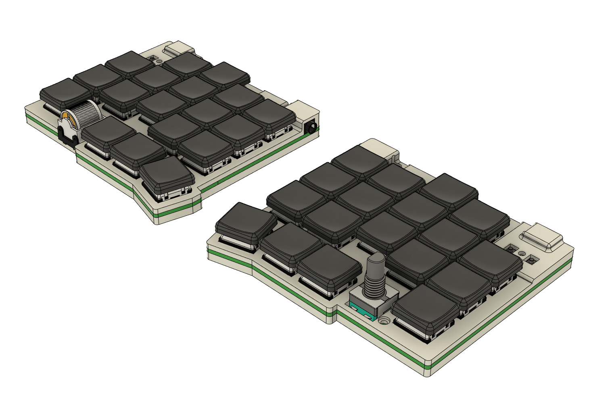
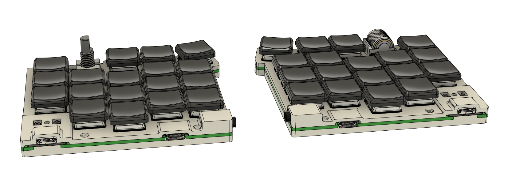

# Smol

Small and cheap low profile split keyboard with 36 keys using RP2040 Zero microcontrollers.

## Features

- 36 keys
- low profile choc switches with hotswap and choc spacing
- per-key RGB matrix
- Waveshare RP2040 Zero controller
- QMK firmware
- TRRS connection between splits (can use USB-C instead but not recommended, too low for many cables)
- Panasonic EVQWGD001 roller encoder (left side only) or EC11 rotary encoder (both sides)

## Photos

## Gerber files

- [PCB](gerbers/pcb.zip)

## Case files

In [STL folder](./stl/) - files for left/right parts. Left also has a version for roller encoder (make sure to order both top and bottom with roller).

## Bill of materials

_Prices for EU with taxes and shipping_

Total cost with required parts: **$42**

- PCBs - $6 (JLCPCB)
- Case (4 parts) - $13 (JLCPCB, white resin)
- 2 Waveshare [RP2040 Zero](https://www.aliexpress.com/item/3256804090654134.html) MCUs - $8.5
- 36 [SMD SOD-123 1N4148](https://www.aliexpress.com/item/1005002882901030.html) diodes - $2
- 1 or 2 [EC11/12 rotary encoder](https://www.aliexpress.com/item/33006686909.html) with [knob](https://www.aliexpress.com/item/1005003425428192.html) - $5
- [Panasonic EVQWGD001 roller encoder](https://www.aliexpress.com/item/32990950196.html) - $9, optional
- 6mm M2 [screws with flat head](https://www.aliexpress.com/item/4001248931159.html) and [nuts](https://www.aliexpress.com/item/1005001412230125.html) - $4
- [TRRS PJ-320A](https://www.aliexpress.com/item/4000661212458.html) connectors - $1.5
- [TRRS cable](https://www.aliexpress.com/item/1005003676559658.html) - $2
- [RGB LEDs](https://www.aliexpress.com/item/1005003636607308.html) - $8.5, optional

## Firmware

QMK:

- [source code](https://github.com/zzeneg/qmk_firmware/tree/feature/smol/keyboards/smol)
- [pre-compiled file](./firmware/qmk/smol_zzeneg.uf2)

Vial:

- [source code](https://github.com/zzeneg/vial-qmk/tree/feature/smol/keyboards/smol)
- [pre-compiled file](./firmware/vial/smol_vial.uf2)

## Changelog

- 2023-06-25 - new case with magnet and feet holes, new Fusion 360 project with design history
